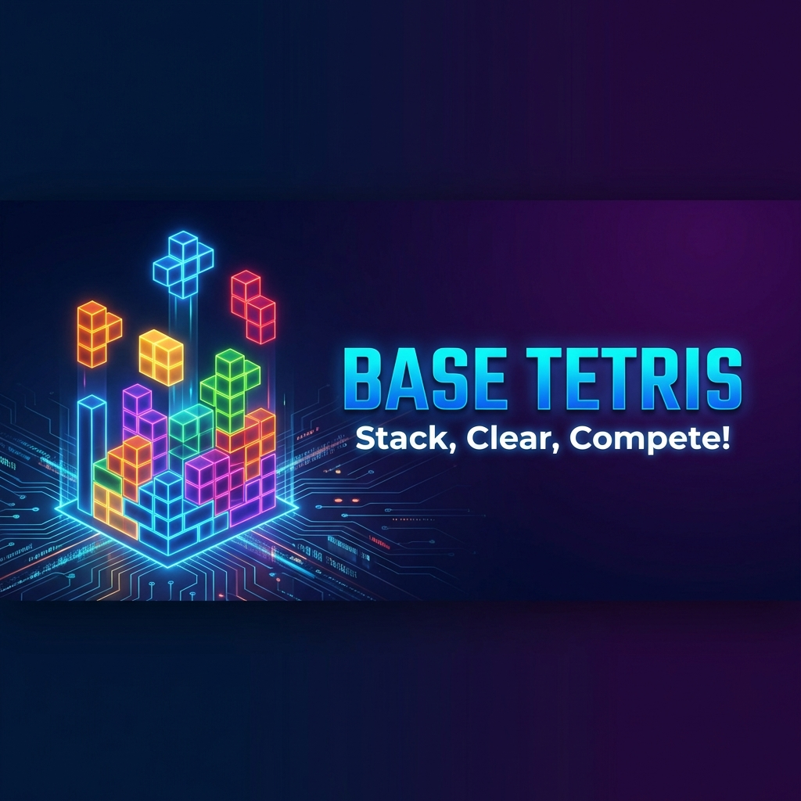

# Base Tetris 🎮

A classic Tetris game built as a Farcaster miniapp for the Base Builder Drop hackathon. Stack blocks, clear lines, and compete for high scores!



## 🚀 Features

### Step 1 (Current) - Prototype

- ✅ Full Tetris gameplay with standard controls
- ✅ Score, lines cleared, and level tracking
- ✅ Hold piece functionality
- ✅ Next piece preview queue
- ✅ High score saved to localStorage
- ✅ Mobile touch controls with haptic feedback
- ✅ Premium dark theme with neon glow effects
- ✅ Farcaster miniapp integration

### Step 2 (Planned) - Supabase Integration

- 🔲 Global leaderboard
- 🔲 User authentication with Farcaster
- 🔲 Real-time score updates

### Step 3 (Planned) - On-Chain Integration

- 🔲 Connect Base wallet
- 🔲 On-chain rewards/achievements
- 🔲 NFT minting for high scores

## 🛠️ Tech Stack

| Category    | Technology                 |
| ----------- | -------------------------- |
| Framework   | Next.js 16 with App Router |
| Language    | TypeScript                 |
| Styling     | Tailwind CSS               |
| Game Engine | react-tetris               |
| Miniapp SDK | @farcaster/miniapp-sdk     |
| Deployment  | Vercel                     |

## 🎮 Controls

### Keyboard (Desktop)

- **Arrow Keys**: Move left/right/down
- **Up / X**: Rotate clockwise
- **Z**: Rotate counter-clockwise
- **Space**: Hard drop
- **C / Shift**: Hold piece
- **P**: Pause/Resume

### Touch (Mobile)

- On-screen D-pad for movement
- DROP button for hard drop
- Rotate and Hold buttons in top row
- Pause button in center

## 🚀 Getting Started

### Prerequisites

- Node.js 22.11.0 or higher
- npm, pnpm, or yarn

### Installation

```bash
# Clone the repository
git clone <repository-url>
cd base-builder-drop

# Install dependencies
npm install

# Run development server
npm run dev
```

Open [http://localhost:3000](http://localhost:3000) to play!

## 📱 Farcaster Miniapp Setup

### For Development

1. Enable Developer Mode in Farcaster (Settings > Developer Tools)
2. Run the dev server locally
3. Use [base.dev/preview](https://base.dev/preview) to test your app

### For Deployment

1. Deploy to Vercel
2. Update `NEXT_PUBLIC_URL` environment variable with your Vercel URL
3. Go to [base.dev/preview?tab=account](https://base.dev/preview?tab=account)
4. Generate account association credentials
5. Update `minikit.config.ts` with the credentials
6. Redeploy to Vercel
7. Cast your app URL to publish!

## 📁 Project Structure

```
base-builder-drop/
├── app/
│   ├── layout.tsx              # Root layout with Farcaster metadata
│   ├── page.tsx                # Main game page
│   ├── globals.css             # Global styles with Tetris theme
│   └── .well-known/
│       └── farcaster.json/
│           └── route.ts        # Farcaster manifest API route
├── components/
│   ├── TetrisGame.tsx          # Main game wrapper
│   ├── GameStats.tsx           # Score/level display
│   ├── GameControls.tsx        # Mobile touch controls
│   └── GameOverModal.tsx       # Game over overlay
├── public/
│   ├── icon.png                # App icon (300x300)
│   ├── splash.png              # Splash screen (200x200)
│   ├── hero.png                # Hero image (1200x630)
│   ├── og-image.png            # Open Graph image
│   └── screenshot1.png         # App screenshot
└── minikit.config.ts           # Miniapp configuration
```

## 🎨 Customization

### Changing App Name

Update the name in `minikit.config.ts`:

```typescript
miniapp: {
  name: "Your App Name",
  // ...
}
```

### Customizing Colors

Edit the Tetris piece colors in `app/globals.css`:

```css
.piece-i {
  background: linear-gradient(135deg, #00d4ff 0%, #0099cc 100%);
  box-shadow: 0 0 10px rgba(0, 212, 255, 0.6);
}
```

## 📄 License

MIT

## 🙏 Acknowledgments

- [react-tetris](https://github.com/brandly/react-tetris) for the game engine
- [Farcaster](https://farcaster.xyz) for the miniapp platform
- [Base](https://base.org) for the Builder Drop hackathon
# base-miniapp-1-tetris
